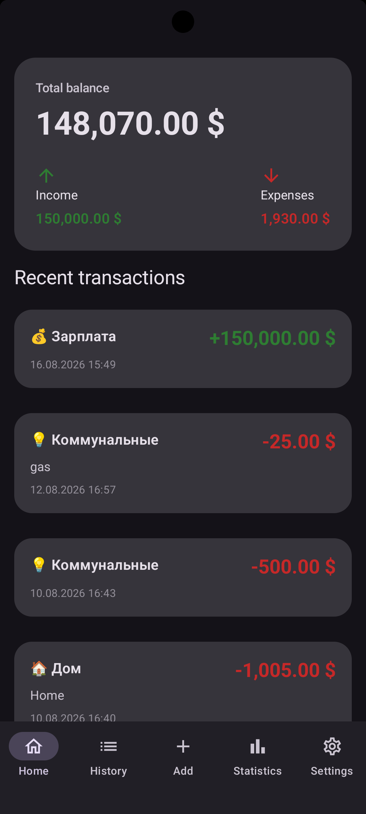
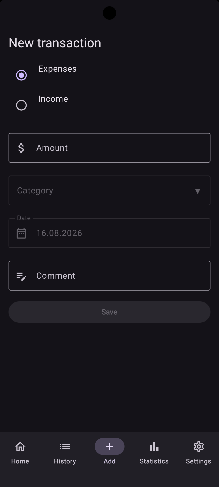
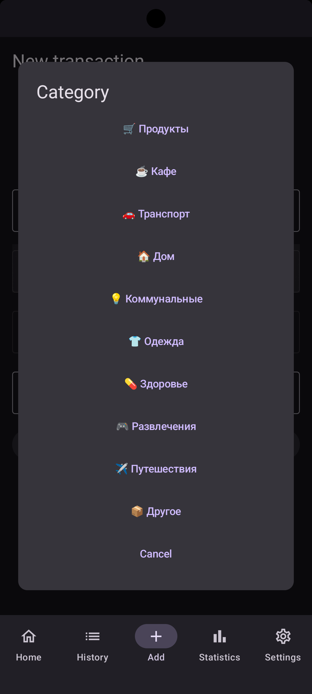

# MoneyFlow 💰

Android-приложение для учёта личных финансов.

MoneyFlow позволяет создавать, редактировать и удалять финансовые операции, разделяя их на доходы и расходы.

Проект создан как портфолио-приложение с использованием современных технологий разработки под Android.

---

## Возможности

Реализовано:

✅ Добавление доходов и расходов  
✅ Ввод суммы операции  
✅ Выбор типа операции (доход / расход)  
✅ Добавление комментария  
✅ Выбор категории операции  
✅ Редактирование операций  
✅ Удаление операций  
✅ Локальное хранение данных

## Известные ограничения

На текущем этапе разработки:

- компонент выбора категории находится в процессе улучшения;
- выбор даты требует доработки.

Основной функционал создания, редактирования и удаления операций реализован.

---

## Технологии

Проект разработан с использованием:

- Kotlin
- Jetpack Compose
- Material 3
- MVVM
- Navigation Compose
- Room Database
- DataStore Preferences
- Kotlin Coroutines
- StateFlow
- KSP

---

## Архитектура

Приложение построено на архитектуре MVVM с разделением ответственности между слоями.

Основная структура проекта:
```text
com.babichdev.moneyflow
│
├── data
│   ├── local
│   ├── repository
│   └── ...
│
├── di
│
├── domain
│   └── ...
│
├── presentation
│   ├── app
│   ├── components
│   │   ├── input
│   │   └── navigation
│   ├── model
│   ├── navigation
│   └── screens
│       ├── add
│       └── ...
│
└── MoneyFlowApp.kt
```

Основные принципы:

- разделение UI и бизнес-логики;
- управление состоянием через ViewModel;
- реактивное обновление интерфейса;
- локальное хранение данных.

---

## Скриншоты

### Главный экран




### Добавление операции




### Выбор категории



---

## UI

Интерфейс полностью реализован на Jetpack Compose.

Используются:

- Composable-функции;
- Material 3 компоненты;
- переиспользуемые UI-компоненты;
- управление состоянием Compose.

---

## Работа с данными

Для хранения информации используется Room Database.

Сохраняемые данные:

- сумма;
- тип операции;
- категория;
- дата;
- комментарий.

---

## ViewModel

ViewModel отвечает за:

- обработку действий пользователя;
- изменение состояния формы;
- сохранение операций;
- удаление операций;
- обновление интерфейса.

Для передачи состояния используется StateFlow.

---

## Пользовательский сценарий

1. Пользователь открывает приложение.
2. Создаёт новую операцию.
3. Выбирает доход или расход.
4. Указывает сумму.
5. Выбирает категорию.
6. Добавляет комментарий.
7. Сохраняет операцию.
8. При необходимости редактирует или удаляет запись.

---

## Минимальная версия Android

Android 8.0 (API 26)

---

## Планы развития

В следующих версиях:

- улучшение выбора категории;
- стабильный выбор даты;
- фильтрация операций;
- статистика доходов и расходов;
- графики;
- экспорт данных;
- дополнительные финансовые инструменты.

---

## Стек:

Kotlin + Jetpack Compose + Room + MVVM